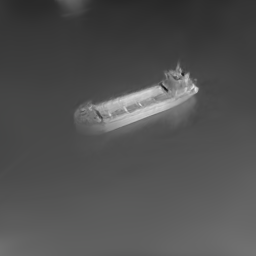
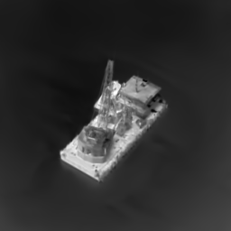
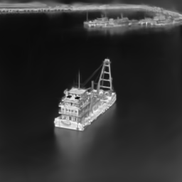
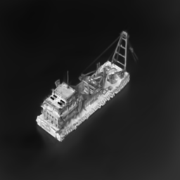
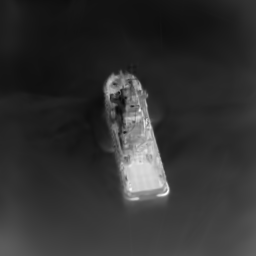

# SparseIR-GS
Codes and datasets for Thermal Target Reconstruction and Novel View Synthesis from Sparse UAV Observations using 3D Gaussian Splatting

Manuscript is under review. The proposed Sanya IR dataset will be released after reception. 

The dataset contains five representative maritime targets, denoted as YHJT, YDWG, PT1, DSYH, and JX158, covering different categories of vessels such as tugboats, experimental ships, and civilian transportation boats. 

For each target, we carefully design UAV flight trajectories to ensure full 360° azimuth coverage with multiple pitch angles, including top-down, mid-level, and shallow oblique views. This structured acquisition strategy is specifically tailored for 3D reconstruction, allowing comprehensive observation of the target geometry from diverse viewpoints.

Each trajectory typically consists of more than 100 infrared images, and the complete dataset comprises a total of 7,414 images, which are resized to $256 \times 256$ resolution for training and evaluation. The dataset exhibits substantial diversity in both geometric structure and thermal appearance, due to varying environmental conditions, viewing angles, and surface heat distributions.

## Results

### JX158

### PT1

### YDWG1

### YDWG2

### YHJT

