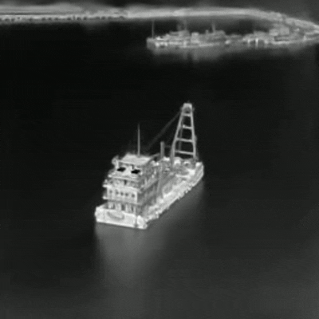
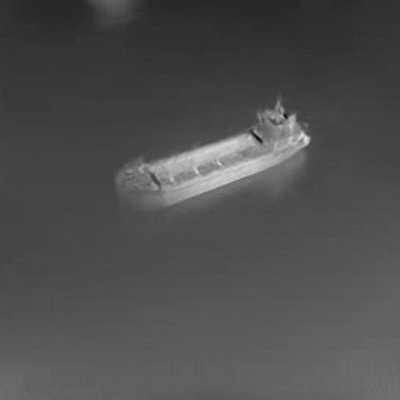
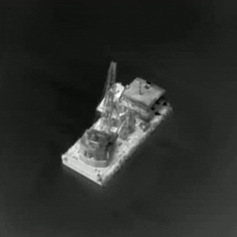
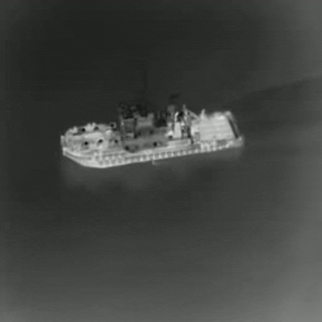

# SparseIR-GS
Datasets for Thermal Target Reconstruction and Novel View Synthesis from Sparse UAV Observations using 3D Gaussian Splatting

Sanya IR dataset contains five representative maritime targets, denoted as YHJT, YDWG, PT1, DSYH, and JX158, covering different categories of vessels such as tugboats, experimental ships, and civilian transportation boats. 

If you require this dataset, please contact ypzhao23@m.fudan.edu.cn, including **your personal information (affiliation)** and the intended use of the dataset in your email. Thank you!

## Results
## Visualization Results
Given 12 input training views, SparseIR-GS reconstructs the infrared scene and uniformly samples 600 novel views along the camera trajectory, which are rendered and saved as the GIF animations shown below.

<table>
  <tr>
    <td align="center">
      <b>YDWG</b> 
      
    </td>
    <td align="center">
      <b>JX158</b> 
      
    </td>
  </tr>
  <tr>
    <td align="center">
      <b>PT1</b> 
      
    </td>
    <td align="center">
      <b>YHJT</b> 
      
    </td>
  </tr>
</table>
